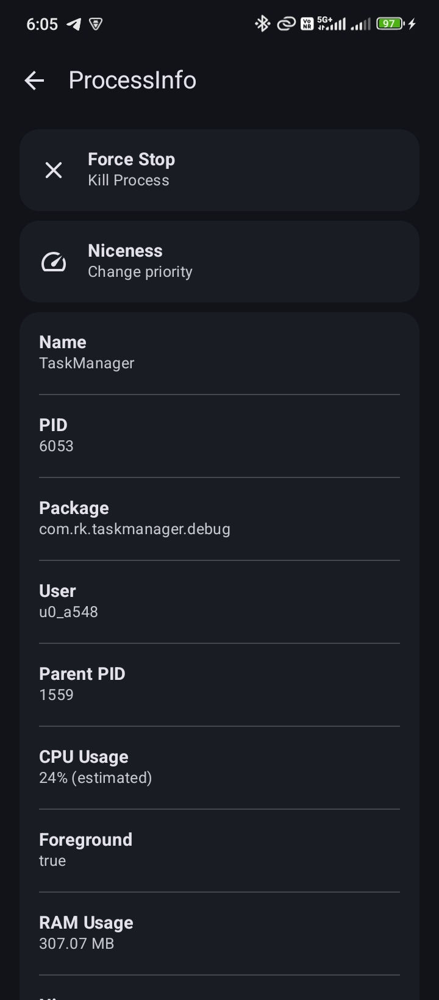

# TaskManager
**Task Manager** is tool for android inspired from gnome system monitor

> [!IMPORTANT]
Task Manager requires shizuku/root to work

# Features
- [x] Monitor cpu usage
- [x] Monitor Ram usage
- [x] Monitor running linux processes
- [x] List process info (eg. ram usage,priority etc.)
- [x] Kill running process (Needs shizuku to be started by root)

# Screenshots

  
    

# Download

[Download](/dl_play.svg)

## Find this app useful? :heart:
Support it by giving a star :star:  
Also, **__[follow](https://github.com/Rohitkushvaha01)__** me for my next creations!

